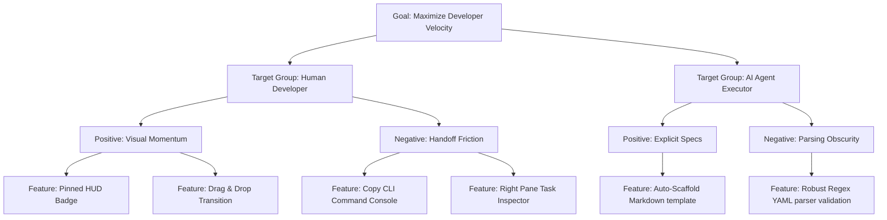

# Trigger Map: bmad-method-project-board

This document maps the project's primary productivity goals to the psychological and operational driving forces of our target groups.

---

## 1. Business Goals

The primary goal of the local Kanban project board is to **maximize developer sprint velocity** by minimizing handoff overhead and keeping humans and AI agents operating in close coordination.

---

## 2. Effect Map (Mermaid Diagram)

---

## 3. Core Driving Forces

### A. Human Developer (Martin)
- **Positive Triggers (Motivation)**:
  - **Visual Momentum**: Seeing a visual layout of the active stories and seeing the progress ring increment.
  - **Frictionless Handoff**: Instantly copying the command to launch the agent without formulating syntax.
- **Negative Triggers (Pain Points)**:
  - **Context-Switching**: Switching between the editor, console logs, and markdown files to check status.
  - **Handoff Friction**: Manually typing or looking up the exact story path to start the agent runner.

### B. AI Agent Executor (Gemini / Antigravity)
- **Positive Triggers (Instructional Clarity)**:
  - **Scaffolded MD Specs**: Pre-formatted markdown checkboxes prevent formatting deviations.
  - **Locked Active Trace**: Instantly finding the active task key in `last-active-story.txt`.
- **Negative Triggers (Failures)**:
  - **Vague Input State**: Attempting to implement a task with missing files or unclear acceptance criteria.
  - **Parser Crashes**: Crashing due to spacing discrepancies or syntax shifts in the status YAML file.
