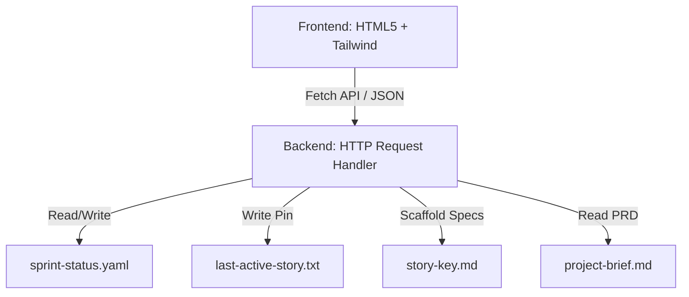

# Architecture Document: BMad Project Board

This document describes the high-level architecture, design patterns, and structural decisions for the BMAD Method Project Board.

---

## 1. Executive Summary
The BMAD Method Project Board is a lightweight, zero-dependency Kanban swimlane board designed to run locally in developer workspaces. It helps teams visualize and transition active stories, inspect subtask checklists, and trace the active workspace task key.

---

## 2. Technology Stack
- **Backend**: Python 3.10+ standard library (`http.server`, `json`, `re`, `argparse`, `urllib.parse`, `pathlib`)
- **Frontend**: Single Page Application (Vanilla JavaScript, HTML5, CSS3)
- **Styling & Assets**: Tailwind CSS via CDN (v3.x), FontAwesome Icons via CDN, Google Fonts (Inter, JetBrains Mono)
- **Data Stores**: Local text-based files (`sprint-status.yaml`, `last-active-story.txt`, and markdown story spec files)

---

## 3. Architecture Patterns
The system follows a simple client-server architecture:
- **Client (Frontend)**: Serves a single-page app displaying a swimlane layout. Communicates asynchronously via HTTP requests using standard `fetch` API.
- **Server (Backend)**: Single-threaded blocking HTTP server. Handles HTTP GET/POST calls by performing regex-based path matching and raw string parsing/writing on status and specification files.



---

## 4. Data Architecture
Persistence uses standard files to allow direct editor interaction and git versioning:
1. **`sprint-status.yaml`**: Standard configuration mapping story and epic states. Parsed using regex to avoid external parser libraries.
2. **`last-active-story.txt`**: Flat text file tracing the currently pinned task in the developer's workspace.
3. **`{story-key}.md`**: Standard markdown document containing metadata frontmatter, acceptance criteria, and checklist subtasks.

---

## 5. API Design
REST API endpoints are manually mapped in the handler's `do_GET` and `do_POST` methods:
- `GET /api/board` -> Fetch full Kanban state.
- `GET /api/story?id=<key>` -> Fetch detailed story content.
- `GET /api/epic?id=<key>` -> Fetch detailed epic content.
- `GET /api/story/active` -> Fetch active pinned task.
- `GET /api/prd` -> Fetch project PRD / Product Brief content.
- `POST /api/story/status` -> Update story workflow status.
- `POST /api/story/active` -> Set active pinned task.
- `POST /api/story/tasks` -> Toggle checklist subtask items.
- `POST /api/story/create` -> Scaffold a new story markdown specification.

---

## 6. Project-Root Resolution & Packaging
To make the Project Board portable and installable in other workspace targets:
1. **Dynamic Workspace Resolution**:
   - The server traverses up from the script execution folder and shell current working directory (CWD) seeking BMad markers: `.agents/` directory, `project-context.md` file, or `_bmad-output/` directory.
   - If found, it binds active directories relative to the resolved workspace. Otherwise, it falls back to CWD.
2. **CLI Path Override**:
   - Accepts `--project-root <path>` argument to explicitly override resolution and set the workspace path.
3. **BMad Packaging**:
   - Exposes a `.agents/manifest.json` file at the repository root describing the `bmad-sprint-status-ui` skill for discovery and automated installation via the BMad command line.

---

## 7. Frontend Accent & Theme System
*   **Theme**: Cyberpunk-adjacent dark theme leveraging Neo-Mint and Teal accents on a deep Slate/Void background.
*   **Layout**: Tri-Pane workspace dividing screens into Epic Roadmap sidebar, Kanban board columns, and a slide-out Task Inspector drawer.
*   **PRD Modal**: Responsive overlay displaying the markdown PRD parsed dynamically by the SPA.

---

## 8. API Payload Specifications

### GET /api/board
*   **Description**: Retrieves full dashboard Kanban board state.
*   **Response (JSON)**:
    ```json
    {
      "sprint_name": "Sprint 1: Core Setup",
      "sprint_goal": "Goal description...",
      "days_remaining": 12,
      "epics": [
        { "id": "epic-1", "name": "Epic Roadmap Name", "progress": 45 }
      ],
      "stories": [
        { "id": "1-1", "title": "Manifest", "status": "ready-for-dev", "epic_id": "epic-1", "tasks_done": 0, "tasks_total": 3 }
      ],
      "active_story_id": "1-1"
    }
    ```

### GET /api/story?id=<key>
*   **Description**: Retrieves full markdown and tasks for a given story.
*   **Response (JSON)**:
    ```json
    {
      "id": "1-1",
      "title": "Story Title",
      "description": "Story description content...",
      "tasks": [
        { "id": 0, "text": "Task description text", "done": false }
      ]
    }
    ```

### POST /api/story/status
*   **Description**: Updates a story's Kanban lane status.
*   **Request Payload (JSON)**:
    ```json
    {
      "id": "1-1",
      "status": "in-progress"
    }
    ```
*   **Response (JSON)**:
    ```json
    {
      "success": true,
      "message": "Status updated successfully"
    }
    ```

### POST /api/story/active
*   **Description**: Pins a story as the active workspace task.
*   **Request Payload (JSON)**:
    ```json
    {
      "id": "1-1"
    }
    ```
*   **Response (JSON)**:
    ```json
    {
      "success": true,
      "message": "Active story pinned successfully"
    }
    ```

### POST /api/story/tasks
*   **Description**: Toggles checkmark status of a specific subtask checklist item.
*   **Request Payload (JSON)**:
    ```json
    {
      "id": "1-1",
      "task_index": 0,
      "done": true
    }
    ```
*   **Response (JSON)**:
    ```json
    {
      "success": true,
      "message": "Task checklist updated successfully"
    }
    ```

### GET /api/prd
*   **Description**: Fetches current project PRD file content for reading in-app.
*   **Response (JSON)**:
    ```json
    {
      "filename": "project-brief.md",
      "content": "# Project Brief..."
    }
    ```

---

## 9. Custom YAML Parser Constraints
To preserve a zero-dependency Python backend, the server parses configuration files using basic text splitting and regular expressions. The following rules must be strictly adhered to:
1.  **Indentation**: Must use spaces (exactly 2 spaces per hierarchy level). Tabs are strictly prohibited and will crash parsing.
2.  **Key-Value Delimiter**: Colons (`:`) must be followed by a single space (e.g. `project: value`).
3.  **Quoting Rules**: Any string value containing colons, hash symbols (`#`), or formatting characters must be enclosed in double quotes.
4.  **Workflow States**: The `development_status` keys must map to exactly one of the six lowercase FSM statuses: `backlog`, `ready-for-dev`, `in-progress`, `blocked`, `review`, or `done`.
