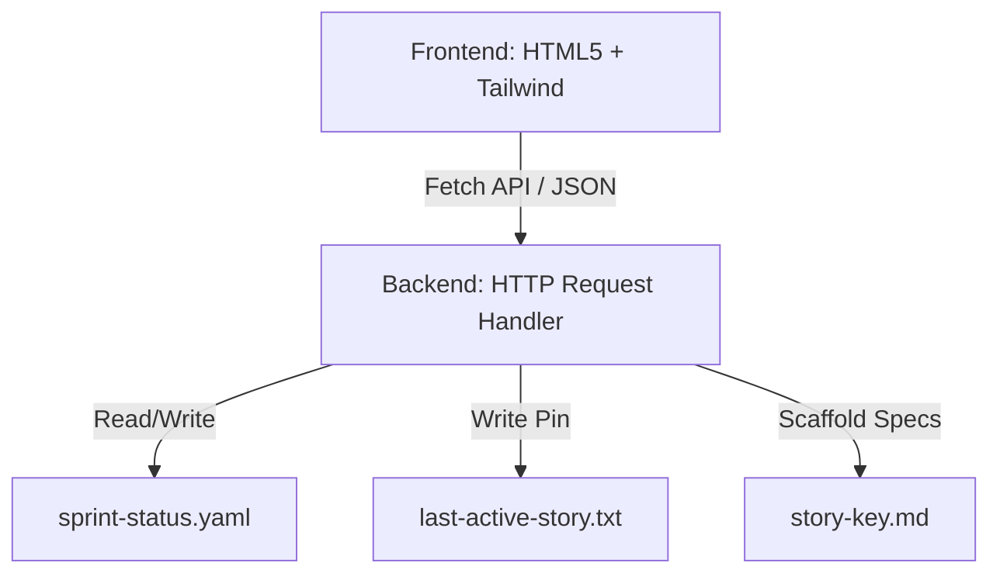

# Architecture Document

This document describes the high-level architecture, design patterns, and structural decisions for the BMAD Method Project Board.

---

## 1. Executive Summary
The BMAD Method Project Board is a lightweight, zero-dependency Kanban swimlane board designed to run locally in developer workspaces. It helps teams visualize and transition active stories, inspect subtask checklists, and trace the active workspace task key.

---

## 2. Technology Stack
- **Backend**: Python 3.10+ standard library (`http.server`, `json`, `re`, `argparse`, `urllib.parse`)
- **Frontend**: Single Page Application (Vanilla JavaScript, HTML5, CSS3)
- **Styling & Assets**: Tailwind CSS via CDN (v3.x), FontAwesome Icons via CDN, Google Fonts (Inter, JetBrains Mono)
- **Data Stores**: Local text-based files (`sprint-status.yaml` and `last-active-story.txt`)

---

## 3. Architecture Patterns
The system follows a simple client-server architecture:
- **Client (Frontend)**: Serves a single-page app displaying a swimlane layout. Communicates asynchronously via HTTP requests using standard `fetch` API.
- **Server (Backend)**: Single-threaded blocking HTTP server. Handles HTTP GET/POST calls by performing regex-based path matching and raw string parsing/writing on status and specification files.

---

## 4. Data Architecture
Persistence uses standard files to allow direct editor interaction and git versioning:
1. **`sprint-status.yaml`**: Standard configuration mapping story and epic states. Parsed using regex to avoid external parser libraries.
2. **`last-active-story.txt`**: Flat text file tracing the currently pinned task in the developer's workspace.
3. **`{story-key}.md`**: Standard markdown document containing metadata frontmatter, acceptance criteria, and checklist subtasks.

---

## 5. API Design
REST API endpoints are manually mapped in the handler's `do_GET` and `do_POST` methods:
- `GET /api/board` -> Fetch full Kanban state.
- `GET /api/story?id=<key>` -> Fetch detailed story content.
- `GET /api/epic?id=<key>` -> Fetch detailed epic content.
- `GET /api/story/active` -> Fetch active pinned task.
- `POST /api/story/status` -> Update story workflow status.
- `POST /api/story/active` -> Set active pinned task.
- `POST /api/story/tasks` -> Toggle checklist subtask items.
- `POST /api/story/create` -> Scaffold a new story markdown specification.

---

## 6. Component Overview
The frontend divides the single-page interface into three logical visual panes:
1. **Epic Roadmap (Left Pane)**: Visualizes higher-level epic scopes and overall completion status metrics.
2. **Kanban Swimlanes (Center Pane)**: Houses the six standard swimlane columns (Backlog, Ready for Dev, In Progress, Blocked, Review, Done). Supports drag-and-drop actions.
3. **Task Inspector (Right Pane)**: Shows checkboxes for subtask status and provides click actions to copy command shortcuts (e.g. `dev this story`).

---

## 7. Development & Deployment
- **Deployment**: Local execution only. Runs as a daemon or background shell process inside the developer's workspace.
- **Development Loop**: Code is updated directly in the local file system. Changes take effect on browser refresh.
